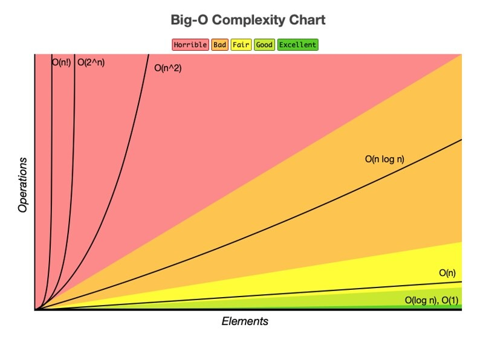

# Universida Politecnica Salesiana 
# Estructura de datos
## Estudinate: Jordan Sagbay, Josue Calle, Sebastian Pillco, Adrian Plaza, Nicol Dominguez
### Fecha: 26/04/2026

## TEORIA DE LA COMPLEJIDAD 
 ## Que es?
La teoría de la complejidad estudia cuántos recursos (tiempo y memoria) necesita un algoritmo para resolver un problema. Clasifica los problemas según su dificultad computacional.

## Eficiencia de Algoritmos
### Coste Temporal
Es el tiempo que tarda un algoritmo en ejecutarse según el tamaño de la entrada (n).
Ejemplo:

Buscar un nombre en una lista de 10 personas → rápido.
Buscar ese mismo nombre en una lista de 1.000.000 → mucho más lento.

### Coste Espacial
Es la memoria RAM que consume un algoritmo durante su ejecución.
Ejemplo:

Un algoritmo que guarda una copia de todos los datos → alto coste espacial.
Un algoritmo que procesa dato por dato sin guardarlos → bajo coste espacial.

## Factores de Tiempo de Ejecución
### Qué es el tiempo de ejecucion?
El tiempo de ejecuccion representa intervalo temporal que transcurre desde que un programa inicia su procesamiento hasta que entrega un resultado final.

En ciencias de la computación, no lo medimos únicamente en segundos, sino en el número de operaciones elementales que el procesador debe realizar para completar la tarea

## Factores propios

Los factores propios son aquellos que dependen directamente del algoritmo o programa en si mismo,sin importar el entorno donde se ejecute
Factores Propios del Tiempo de Ejecución
Son los que dependen directamente del algoritmo o programa, controlables por el programador:

1  (Big O) — Cómo crece el tiempo según el tamaño de la entrada (O(1), O(n), O(n²), etc.)
2 Número de operaciones — Cuántas instrucciones ejecuta por cada paso (asignaciones, comparaciones, cálculos).
3 Estructura de control — Bucles anidados, recursividad y condicionales determinan cuántas veces se ejecuta cada parte.
4 Estructuras de datos — Usar la correcta (array, hash table, árbol) puede cambiar una búsqueda de O(n) a O(1).
5 Gestión de memoria — Reservas dinámicas frecuentes y datos dispersos en memoria ralentizan el programa.
6 Cálculos redundantes — Repetir operaciones innecesarias; se evita con memoización o programación dinámica.
7 Caso de análisis — El mismo algoritmo puede tener mejor caso, caso promedio y peor caso con tiempos muy distintos.
## Factores Circunstanciales

Factores Circunstanciales del Tiempo de Ejecución
Los factores circunstanciales son condiciones externas al algoritmo o programa que influyen en su tiempo de ejecución real, independientemente de su complejidad teórica.

1 Hardware

Velocidad del procesador (CPU): Mayor frecuencia de reloj = instrucciones más rápidas.
Número de núcleos: Afecta la ejecución paralela.
Memoria RAM: Poca RAM genera swapping (uso de disco), lo que ralentiza todo.
Caché del procesador (L1, L2, L3): Los datos en caché se acceden mucho más rápido que en RAM.

2 Sistema Operativo

Planificador de procesos: El SO decide cuándo y cuánto tiempo corre tu proceso.
Procesos en segundo plano: Otros programas compiten por CPU y memoria.
Interrupciones del sistema: El SO puede pausar tu proceso en cualquier momento.

3 Estado de los Datos de Entrada

Tamaño de la entrada (n): Más datos generalmente = más tiempo.
Distribución de los datos: Un algoritmo de ordenamiento puede tardar muy poco si los datos ya están casi ordenados (mejor caso) o mucho si están al revés (peor caso).
Tipo de datos: Enteros vs. cadenas de texto vs. objetos complejos.

4 Red y Entrada/Salida (I/O)

Velocidad de disco (HDD vs SSD vs NVMe): La lectura/escritura puede dominar el tiempo total.
Latencia de red: En sistemas distribuidos, el tiempo de transmisión es determinante.
Ancho de banda disponible: Afecta transferencia de grandes volúmenes de datos.

5 Lenguaje de Programación y Compilador

Lenguaje compilado vs. interpretado: C++ es generalmente más rápido que Python.
Nivel de optimización del compilador: -O2, -O3 en GCC pueden reducir significativamente el tiempo.

## Analisis teorico y analisis experimental 

 Análisis Teórico
Se estudia el algoritmo matemáticamente, sin ejecutarlo.

Se cuenta el número de operaciones en función de n
Se expresa con notación Big O (O(n), O(n²), etc.)
Es independiente del hardware o lenguaje
Determina el mejor, peor y caso promedio

 Análisis Experimental
Se ejecuta el programa real y se mide el tiempo.

Se usan herramientas como cronómetros, profilers o benchmarks
Depende del hardware, SO y lenguaje usado
Se prueba con distintos tamaños de entrada
Los resultados se grafican para observar el comportamiento real

### Que es la notacion Big O
a notación Big O es el lenguaje que usamos en la computación para describir el rendimiento o la complejidad de un algoritmo.

En lugar de medir el tiempo exacto en segundos que depende del procesador o la memoria, la Big O mide cómo aumenta el tiempo de ejecución o el uso de memoria a medida que crece el tamaño de los datos de entrada denominado n.
### Tipos de notaciones
### 1. Big O (O): El Techo (Peor Caso)
Es la cota superior. Nos dice que el algoritmo nunca será más lento que esta función 
enfocando garantia en su rendmiento un ejemplo puede ser que exite 30 min en limite de timpo para realizar una activada podria ser 10, 20 pero nunca mas de 30 
### 2. Big Omega (Ω): El Suelo (Mejor caso)
Representa el mejor de los casos. Nos dice cuál es la velocidad máxima teórica que el algoritmo puede alcanzar con los mejores datos posibles. Para saber qué tan rápido puede llegar a ser un algoritmo si todo sale perfecto.un ejemplo de analogia  "Llegaré a tu casa en al menos 10 minutos es imposible que llegue antes, aunque no haya tráfico".
### 3. Big Theta (Θ): El Rango Exacto (Caso Promedio)
Es la cota ajustada. Ocurre cuando el límite superior y el inferior son el mismo. Encierra a la función por ambos lados.

Enfoque: Comportamiento preciso.

Ejemplo: Si un algoritmo es Θ(nlogn), significa que su tiempo de ejecución crece exactamente a ese ritmo, sin importar si los datos son favorables o no.

Comparación con una analogía de viaje

Imagina que vas de una ciudad a otra en auto:

Omega (Ω): "Llegaré en al menos 2 horas". Es imposible llegar antes por los límites de velocidad.

Big O (O): "Llegaré en máximo 5 horas". (Aun si hay tráfico o un accidente, no tardaré más de eso).

Theta (Θ): "El viaje dura exactamente entre 3 y 3.5 horas". (Es una estimación precisa del comportamiento real).

### Mejor Caso (Best Case)
Es el escenario donde el algoritmo realiza la mínima cantidad de trabajo posible. Ocurre cuando los datos de entrada tienen la estructura ideal para el código.

•	En la búsqueda lineal: El número que buscas es el primero de la lista.

•	Complejidad: Ω(1) (Constante).

•	Utilidad: En la práctica, se usa poco porque no puedes confiar en que los datos siempre vendrán "perfectos".
#### 2. Peor Caso (Worst Case)
Es el escenario donde el algoritmo realiza la máxima cantidad de trabajo. Es el más importante en computación porque define el límite de seguridad.

•	En la búsqueda lineal: El número que buscas es el último de la lista o ni siquiera existe. Tienes que recorrer los n elementos.

•	Complejidad: O(n) (Lineal).
•	Utilidad: Es el estándar de la industria. Si sabes que tu peor caso es aceptable, garantizas que tu programa nunca será más lento que eso.
### 3. Caso Promedio (Average Case)
Es lo que sucede en el "mundo real". Se calcula asumiendo que los datos de entrada están distribuidos de forma aleatoria. Requiere un análisis matemático más complejo.

•	En la búsqueda lineal: En promedio, encontrarías el número cerca de la mitad de la lista (n/2).

•	Complejidad: Θ(n) (Sigue siendo lineal, ya que en notación asintótica ignoramos la división por 2).

•	Utilidad: Ayuda a predecir el rendimiento diario del software bajo condiciones normales.

### 1. O(1) - Constante (El acceso directo)

Definición: El tiempo de ejecución es independiente del tamaño del conjunto de datos.

En el código: Al hacer return arr[0], el equipo solo realiza una operación de lectura en memoria. No importa si el arreglo tiene diez elementos o diez billones, la dirección de memoria del primer índice se calcula instantáneamente.
### 2. O(logn) - Complejidad Logarítmica

Definición: En cada paso, el algoritmo reduce el tamaño de los datos a procesar (generalmente a la mitad).

En el código: La Búsqueda Binaria divide el arreglo por la mitad. Si el valor no está en el medio, descarta la mitad donde sabe que no puede estar.

Escalabilidad: Es extremadamente eficiente. Para buscar en 1,000,000 de elementos, solo necesita unos 20 pasos (2^20 ≈1,000,000).
### 3. O(n) - Complejidad Lineal

Definición: El tiempo de ejecución crece en proporción directa al tamaño de la entrada.

En el código: Un bucle for que recorre el arreglo de inicio a fin. Si duplicas el número de elementos, el tiempo de ejecución se duplica exactamente.
### 4. O(nlogn) - Linearithmic 

Definición: Es el resultado de ejecutar un algoritmo logarítmico n veces.

En el código: Algoritmos de ordenamiento como Arrays.sort() (basados en Quicksort o Mergesort). Dividen el problema (log n) y procesan cada elemento (n). Es el estándar de oro para ordenar datos de forma eficiente.
### 5. O(n^2) - Complejidad Cuadrática

Definición: El tiempo de ejecución es proporcional al cuadrado del tamaño de la entrada.

En el código: El Bubble Sort. Tiene un bucle anidado. Por cada elemento del arreglo (n), vuelve a recorrer el arreglo completo (n).

Impacto: Si n=1,000, realizas 1,000,000 de operaciones. Se vuelve ineficiente muy rápido.
### 6. O(n 3) - Complejidad Cúbica

Definición: El tiempo crece al cubo de la entrada.

En el código: Tres bucles anidados. Es común en multiplicaciones de matrices básicas o en la búsqueda de combinaciones de tres elementos.
Impacto: Si n=1,000, el procesador debe hacer 1,000,000,000 (mil millones) de operaciones.
### 7. O(2n) - Complejidad Exponencial

Definición: El crecimiento se duplica con cada unidad adicional en n.

En el código: El cálculo de Fibonacci recursivo. Cada llamada a la función genera dos llamadas adicionales. Esto crea un árbol de llamadas que crece masivamente.

Riesgo: Un n=40 ya puede tardar varios segundos o minutos, dependiendo de la potencia del procesador.

### 8. O(n!) - Complejidad Factorial

Definición: El tiempo crece según el producto de todos los números enteros hasta n.

En el código: Generar permutaciones. Para encontrar todas las formas de ordenar una cadena, el algoritmo debe explorar cada ruta posible.

Riesgo: Es la complejidad más costosa. Solo es viable para valores de n muy pequeños (menores a 12 o 13 habitualmente).
## Conlusiones.
### ¿Qué complejidad es más costosa y por qué?
Las complejidades más costosas son la *Factorial $O(n!)$* y la *Exponencial $O(2^n)$*.

Porque en estas categorías el número de operaciones crece de forma explosiva ante incrementos mínimos en el tamaño de la entrada ($n$).

Mientras que en una complejidad lineal $O(n)$, duplicar los datos duplica el tiempo, en una *exponencial, añadir un solo dato puede **duplicar* el tiempo total. 

En la *factorial*, el crecimiento es tan violento que incluso con supercomputadoras, problemas con un $n > 20$ pueden tardar años en resolverse. Son algoritmos que "no escalan" y deben evitarse o sustituirse por aproximaciones en la práctica profesional.

### ¿Qué aprendieron del análisis?
El aprendizaje clave es que *el hardware no puede compensar un mal algoritmo*. 
Aprendimos que la eficiencia no es solo "escribir código que funcione", sino escribir código que sea sostenible. 

El *análisis teórico* nos da la seguridad de cómo se comportará el software en el futuro, mientras que el *análisis experimental* nos permite entender cómo influyen factores externos (como la memoria RAM o el procesador) en el rendimiento real. 

La elección de la *estructura de datos* correcta es el factor más determinante para reducir la complejidad de $O(n)$ a $O(\log n)$ o incluso $O(1)$.

### ¿Qué les sorprendió más al ver el código?

A simple vista, un código con dos o tres bucles for parece inofensivo, pero al analizarlo bajo la lupa de la *Complejidad Cuadrática $O(n^2)$* o *Cúbica $O(n^3)$*, se hace evidente que el rendimiento caerá en picada en cuanto los datos de entrada aumenten.

### Lo que ustedes crean conveniente

Es vital entender que la *Optimización Prematura* puede ser un error; no siempre necesitamos un algoritmo $O(1)$ para procesar 10 datos. Sin embargo, como futuros ingenieros, nuestra responsabilidad es identificar los "cuellos de botella" antes de que el software llegue al usuario final. 